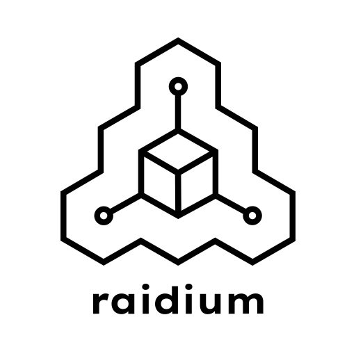
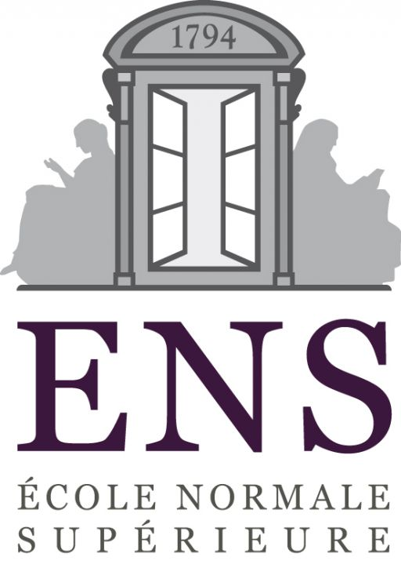
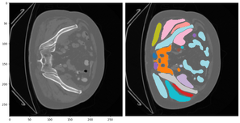

# ENS and Raidium data challenge  
This is the repo that got me 6th place in 15th of december 2025 with a dice score of 0,52.  
15th of december 2025 was supposed to mark the end of the competition but it got postponed.  
In the mean time, other participants have made it above my score 😥 and I am now 10th.  
But I might give it another shot and try to increase my score to get first place.  

### Problem:
We are give a dataset of 2000 CT-Scam images, ~800 of which are partially segmented.  
Our goal will be to train a segementation model to segment the rest of the images.  
No external medical imaging datasets and models are allowed.  
However generic datasets and models are allowed.  

### My solutions:
My best performing solution is a UNet trained with:
-   A batch size of 1
    > For some unkown reason I the training was very sensitive to the batch size.  
    > I assume this is because of the fact that the labeled images are partially segmented, but I am not sure.  
- heavy data augmentation including a lot of random erasing
- AdamW optimizer

This first supervised solution does not exploit all the data available since it only uses the 800 labeled images, and even those aren't fully labeled (so it's actually a weakly supervised solution).
I actually spent most of the competition on semi(weakly)supervised learning solutions.
Sadly, I couldn't get them to outperform the supervised solution.

The most promessing one I was a SwinViT pretrained with simMIM(simple Masked Image Modeling) and finetuned in the same way as the UNet was trained.
You can view some of the reconstructed images in the viz_hf_swin_reoncstruction notebook.